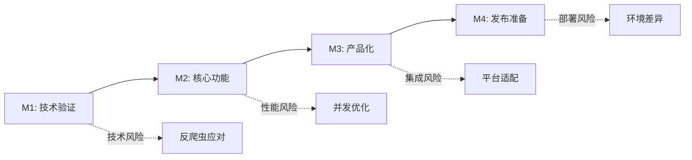

# 🎯 Canva简报下载系统 - 里程碑规划

## 📅 总体时程概览
**项目周期**: 6周 (42天)
**里程碑数量**: 4个主要里程碑
**验收方式**: 每2周进行里程碑评审

## 🏁 里程碑概览

| 里程碑 | 时间范围 | 主要目标 | 验收标准 | 风险等级 |
|--------|----------|----------|----------|----------|
| M1 | Week 1-2 | 技术验证 + MVP基础 | 基础功能可演示 | 🔴 高 |
| M2 | Week 3-4 | 核心功能完成 | 完整下载流程 | 🟡 中 |
| M3 | Week 5-6 | 产品化完善 | 用户就绪版本 | 🟢 低 |
| M4 | Week 6 | 发布准备 | 生产环境部署 | 🟡 中 |

---

## 🎯 M1: 技术验证与MVP基础 (Week 1-2)

### 📋 主要目标
验证核心技术可行性，建立项目基础架构，实现最小可用版本。

### 🎯 具体任务

#### Week 1: 项目启动与技术验证
**Day 1: 项目设置**
- [ ] 创建Next.js项目结构
- [ ] 配置TypeScript + Tailwind CSS
- [ ] 集成到shared-tools架构
- [ ] 环境变量配置

**Day 2-3: 核心技术验证**
- [ ] Puppeteer环境搭建和测试
- [ ] Canva页面结构分析
- [ ] 基础截图功能实现
- [ ] 反爬虫机制初步分析

**Day 4-5: URL解析模块**
- [ ] Canva URL格式分析
- [ ] URL验证逻辑实现
- [ ] 错误处理机制
- [ ] 单元测试覆盖

**Day 6: 基础界面**
- [ ] 简单的URL输入界面
- [ ] 基础样式设计
- [ ] 响应式布局

#### Week 2: MVP核心功能
**Day 7-8: 截图引擎**
- [ ] 高分辨率截图实现
- [ ] 页面加载等待机制
- [ ] 动态内容处理
- [ ] 错误重试逻辑

**Day 9-10: PDF生成**
- [ ] jsPDF集成和配置
- [ ] 单页PDF生成
- [ ] 多页合并功能
- [ ] 质量优化

**Day 11-12: MVP整合**
- [ ] 完整流程打通
- [ ] 基础错误处理
- [ ] 简单进度反馈
- [ ] 功能测试

### 📊 验收标准
- [ ] **技术可行性**: 能够成功截图并生成PDF
- [ ] **基础功能**: URL输入 → 处理 → 下载完整流程
- [ ] **质量要求**: 生成的PDF清晰可读
- [ ] **错误处理**: 基本的错误提示和处理
- [ ] **性能基准**: 单页处理时间 < 10秒

### 🚨 关键风险
1. **Canva反爬虫**: 可能阻止自动化访问
2. **截图质量**: 分辨率和清晰度问题
3. **内存管理**: Puppeteer内存使用过高

### 📈 成功指标
- 技术POC演示成功
- 基础功能流程完整
- 代码质量达标 (ESLint + TypeScript)

---

## 🎯 M2: 核心功能完成 (Week 3-4)

### 📋 主要目标
完善核心下载功能，实现稳定可靠的批量处理能力，优化用户体验。

### 🎯 具体任务

#### Week 3: 功能完善
**Day 13-14: 批量处理**
- [ ] 多URL并发处理
- [ ] 队列管理系统
- [ ] 进度追踪机制
- [ ] 资源管理优化

**Day 15-16: 高级截图功能**
- [ ] 多分辨率支持
- [ ] 自定义截图参数
- [ ] 等待策略优化
- [ ] 截图质量控制

**Day 17-18: 错误处理与重试**
- [ ] 智能重试机制
- [ ] 详细错误分类
- [ ] 日志记录系统
- [ ] 用户友好的错误提示

#### Week 4: 用户体验优化
**Day 19-20: 界面改进**
- [ ] 现代化UI设计
- [ ] 实时进度显示
- [ ] 拖拽文件支持
- [ ] 移动端适配

**Day 21-22: 性能优化**
- [ ] 内存使用优化
- [ ] 并发处理调优
- [ ] 缓存机制实现
- [ ] 性能监控

**Day 23-24: 功能测试**
- [ ] 完整功能测试
- [ ] 边界情况测试
- [ ] 性能压力测试
- [ ] 用户体验测试

### 📊 验收标准
- [ ] **批量处理**: 支持5个URL并发处理
- [ ] **用户界面**: 完整的进度反馈和错误提示
- [ ] **性能标准**: 达到预设的处理时间目标
- [ ] **稳定性**: 连续运行不出现内存泄漏
- [ ] **兼容性**: 支持不同类型的Canva链接

### 🚨 关键风险
1. **并发性能**: 多任务处理可能影响稳定性
2. **内存管理**: 批量处理内存压力
3. **用户体验**: 复杂度增加可能影响易用性

### 📈 成功指标
- 批量下载功能正常工作
- 用户界面完整且易用
- 性能指标达到目标值

---

## 🎯 M3: 产品化完善 (Week 5-6)

### 📋 主要目标
完善产品功能，实现生产就绪版本，确保用户体验和系统稳定性。

### 🎯 具体任务

#### Week 5: 高级功能
**Day 25-26: 下载历史管理**
- [ ] 历史记录存储
- [ ] 下载历史界面
- [ ] 重新下载功能
- [ ] 历史清理机制

**Day 27-28: 高级设置**
- [ ] 用户偏好设置
- [ ] 下载质量选项
- [ ] 输出格式选择
- [ ] 高级参数配置

**Day 29-30: 安全与合规**
- [ ] 使用条款检查
- [ ] 安全性评估
- [ ] 数据隐私保护
- [ ] 访问频率限制

#### Week 6: 产品完善
**Day 31-32: 用户体验优化**
- [ ] 界面微调和polish
- [ ] 用户指引和帮助
- [ ] 快捷操作支持
- [ ] 无障碍访问优化

**Day 33-34: 系统集成**
- [ ] shared-tools平台集成
- [ ] 统一认证和权限
- [ ] 数据共享机制
- [ ] 监控和日志集成

**Day 35-36: 测试与修复**
- [ ] 完整系统测试
- [ ] Bug修复和优化
- [ ] 性能调优
- [ ] 文档完善

### 📊 验收标准
- [ ] **功能完整**: 所有计划功能正常工作
- [ ] **用户体验**: 界面美观、操作流畅
- [ ] **系统集成**: 无缝集成到shared-tools
- [ ] **质量保证**: 通过完整测试套件
- [ ] **文档完善**: 用户文档和技术文档齐全

### 🚨 关键风险
1. **集成复杂性**: 与现有系统集成可能出现问题
2. **性能影响**: 新功能可能影响系统性能
3. **用户采用**: 功能复杂度可能影响用户采用

### 📈 成功指标
- 完整产品功能可用
- 用户测试反馈积极
- 系统性能稳定

---

## 🎯 M4: 发布准备 (Week 6)

### 📋 主要目标
完成最终的发布准备工作，确保生产环境部署顺利，建立运维支持体系。

### 🎯 具体任务

**Day 37-38: 部署准备**
- [ ] 生产环境配置
- [ ] CI/CD流程设置
- [ ] 环境变量管理
- [ ] 备份和恢复策略

**Day 39-40: 监控与运维**
- [ ] 性能监控设置
- [ ] 错误报告系统
- [ ] 日志分析配置
- [ ] 报警机制建立

**Day 41-42: 发布执行**
- [ ] 生产环境部署
- [ ] 功能验证测试
- [ ] 用户培训材料
- [ ] 项目总结文档

### 📊 验收标准
- [ ] **部署成功**: 生产环境正常运行
- [ ] **监控完善**: 监控和报警系统正常
- [ ] **文档齐全**: 用户和运维文档完整
- [ ] **团队准备**: 团队具备运维支持能力

### 🚨 关键风险
1. **部署问题**: 生产环境可能出现意外问题
2. **性能差异**: 生产环境性能与测试环境不符
3. **用户反馈**: 首批用户可能发现新问题

### 📈 成功指标
- 系统成功上线运行
- 首批用户正常使用
- 监控数据正常

---

## 📊 里程碑间依赖关系

## 🎯 里程碑评审机制

### 评审标准
1. **功能完成度**: 计划功能是否按时完成
2. **质量指标**: 代码质量和测试覆盖率
3. **性能指标**: 是否达到预设性能目标
4. **风险状况**: 识别和应对的风险情况

### 评审流程
1. **自评**: 开发团队内部评审
2. **同行评审**: 技术专家评审
3. **用户验证**: 关键用户试用反馈
4. **决策点**: 继续/调整/暂停决策

### 调整机制
- **轻微调整**: 单个任务延期 < 2天
- **中度调整**: 里程碑内容调整 < 20%
- **重大调整**: 里程碑时间延期或内容大幅变更

---

**最后更新**: 2025-08-02
**版本**: v1.0
**负责人**: 项目团队