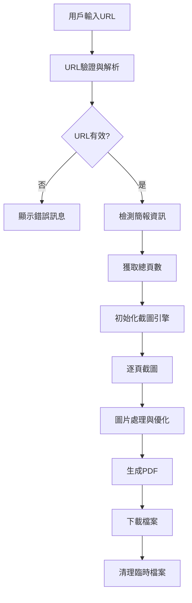

# 技術規格文件 (Technical Specification)

## 系統架構詳細設計

### 核心模組設計

#### 1. URL解析模組 (URL Parser Module)
```typescript
interface CanvaUrlParser {
  parseUrl(url: string): CanvaDesignInfo | null;
  validateUrl(url: string): boolean;
  extractDesignId(url: string): string;
  getDesignType(url: string): 'presentation' | 'document' | 'design';
}

interface CanvaDesignInfo {
  designId: string;
  designType: string;
  isPublic: boolean;
  hasEditAccess: boolean;
}
```

#### 2. 截圖引擎模組 (Screenshot Engine)
```typescript
interface ScreenshotEngine {
  captureSlide(url: string, slideIndex: number, options: CaptureOptions): Promise<Buffer>;
  captureAllSlides(url: string, options: CaptureOptions): Promise<Buffer[]>;
  getSlideCount(url: string): Promise<number>;
}

interface CaptureOptions {
  width: number;
  height: number;
  quality: number;
  format: 'png' | 'jpeg';
  waitForLoad: number;
}
```

#### 3. PDF生成模組 (PDF Generator)
```typescript
interface PdfGenerator {
  createPdfFromImages(images: Buffer[], options: PdfOptions): Promise<Buffer>;
  addMetadata(pdf: Buffer, metadata: PdfMetadata): Promise<Buffer>;
  optimizePdf(pdf: Buffer, compressionLevel: number): Promise<Buffer>;
}

interface PdfOptions {
  pageSize: 'A4' | 'Letter' | 'Custom';
  orientation: 'portrait' | 'landscape';
  margin: { top: number; right: number; bottom: number; left: number };
  quality: number;
}
```

### 資料流程設計



### 錯誤處理策略

#### 1. 網路錯誤處理
- 連線超時：30秒自動重試，最多3次
- DNS解析失敗：提示檢查網路連線
- HTTP錯誤：根據狀態碼提供具體建議

#### 2. Canva平台錯誤
- 私人簡報：提示需要分享權限
- 已刪除內容：提示內容不存在
- 載入失敗：建議重新整理頁面

#### 3. 資源限制錯誤
- 記憶體不足：降低截圖品質
- 硬碟空間不足：提示清理空間
- 處理超時：分批處理機制

## 性能優化策略

### 1. 記憶體管理
```typescript
class MemoryManager {
  private maxMemoryUsage = 512 * 1024 * 1024; // 512MB
  private currentUsage = 0;
  
  async processWithMemoryLimit<T>(
    operation: () => Promise<T>,
    estimatedMemory: number
  ): Promise<T> {
    if (this.currentUsage + estimatedMemory > this.maxMemoryUsage) {
      await this.freeMemory();
    }
    return operation();
  }
}
```

### 2. 並行處理優化
```typescript
class ParallelProcessor {
  private concurrentLimit = 3;
  
  async processSlides(
    urls: string[],
    processor: (url: string) => Promise<Buffer>
  ): Promise<Buffer[]> {
    const chunks = this.chunkArray(urls, this.concurrentLimit);
    const results: Buffer[] = [];
    
    for (const chunk of chunks) {
      const promises = chunk.map(processor);
      const chunkResults = await Promise.allSettled(promises);
      results.push(...this.handleResults(chunkResults));
    }
    
    return results;
  }
}
```

### 3. 快取策略
```typescript
interface CacheManager {
  getCachedScreenshot(url: string, options: CaptureOptions): Promise<Buffer | null>;
  setCachedScreenshot(url: string, options: CaptureOptions, data: Buffer): Promise<void>;
  clearExpiredCache(): Promise<void>;
}
```

## 安全性考量

### 1. 輸入驗證
- URL格式驗證：確保輸入為有效的Canva URL
- XSS防護：清理所有用戶輸入
- CSRF保護：使用CSRF token

### 2. 資料保護
- 臨時檔案加密：使用AES-256加密
- 自動清理：30分鐘後自動刪除臨時檔案
- 無日誌政策：不記錄用戶下載內容

### 3. 速率限制
```typescript
class RateLimiter {
  private requests = new Map<string, number[]>();
  private maxRequestsPerMinute = 10;
  
  isAllowed(clientId: string): boolean {
    const now = Date.now();
    const clientRequests = this.requests.get(clientId) || [];
    const recentRequests = clientRequests.filter(time => now - time < 60000);
    
    if (recentRequests.length >= this.maxRequestsPerMinute) {
      return false;
    }
    
    recentRequests.push(now);
    this.requests.set(clientId, recentRequests);
    return true;
  }
}
```

## 部署配置

### 1. 環境變數
```env
# 應用配置
NEXT_PUBLIC_APP_URL=https://your-domain.com
NEXT_PUBLIC_MAX_FILE_SIZE=50MB
NEXT_PUBLIC_MAX_PAGES=100

# Puppeteer配置
PUPPETEER_EXECUTABLE_PATH=/usr/bin/chromium-browser
PUPPETEER_ARGS=--no-sandbox,--disable-setuid-sandbox

# 效能配置
MAX_CONCURRENT_DOWNLOADS=3
SCREENSHOT_TIMEOUT=30000
PDF_COMPRESSION_LEVEL=0.8
```

### 2. Docker配置
```dockerfile
FROM node:18-alpine

# 安裝Chromium依賴
RUN apk add --no-cache \
    chromium \
    nss \
    freetype \
    freetype-dev \
    harfbuzz \
    ca-certificates \
    ttf-freefont

# 設定Puppeteer環境
ENV PUPPETEER_SKIP_CHROMIUM_DOWNLOAD=true \
    PUPPETEER_EXECUTABLE_PATH=/usr/bin/chromium-browser

WORKDIR /app
COPY package*.json ./
RUN npm ci --only=production
COPY . .
RUN npm run build

EXPOSE 3000
CMD ["npm", "start"]
```

### 3. Vercel配置
```json
{
  "functions": {
    "src/app/api/**/*.ts": {
      "maxDuration": 60
    }
  },
  "env": {
    "PUPPETEER_CACHE_DIR": "/tmp/.cache/puppeteer"
  }
}
```

## 測試策略

### 1. 單元測試
```typescript
describe('CanvaUrlParser', () => {
  test('should parse valid Canva URL', () => {
    const parser = new CanvaUrlParser();
    const result = parser.parseUrl('https://www.canva.com/design/DAGutBPLlkA/view');
    
    expect(result).toEqual({
      designId: 'DAGutBPLlkA',
      designType: 'presentation',
      isPublic: true,
      hasEditAccess: false
    });
  });
});
```

### 2. 整合測試
```typescript
describe('Screenshot Integration', () => {
  test('should capture slide with correct dimensions', async () => {
    const engine = new ScreenshotEngine();
    const buffer = await engine.captureSlide(testUrl, 1, {
      width: 1920,
      height: 1080,
      quality: 90,
      format: 'png',
      waitForLoad: 5000
    });
    
    expect(buffer).toBeInstanceOf(Buffer);
    expect(buffer.length).toBeGreaterThan(0);
  });
});
```

### 3. E2E測試
```typescript
describe('Complete Download Flow', () => {
  test('should download presentation as PDF', async () => {
    // 模擬完整用戶流程
    const result = await downloadCanvaPresentation(testUrl, {
      quality: 'high',
      format: 'pdf'
    });
    
    expect(result.success).toBe(true);
    expect(result.fileSize).toBeGreaterThan(0);
    expect(result.pageCount).toBeGreaterThan(0);
  });
});
```

## 監控與分析

### 1. 性能監控
```typescript
class PerformanceMonitor {
  trackDownloadTime(duration: number, pageCount: number): void {
    const avgTimePerPage = duration / pageCount;
    analytics.track('download_performance', {
      duration,
      pageCount,
      avgTimePerPage
    });
  }
  
  trackMemoryUsage(peakMemory: number): void {
    analytics.track('memory_usage', { peakMemory });
  }
}
```

### 2. 錯誤追蹤
```typescript
class ErrorTracker {
  logError(error: Error, context: Record<string, any>): void {
    console.error('Application Error:', {
      message: error.message,
      stack: error.stack,
      context,
      timestamp: new Date().toISOString()
    });
  }
}
```

### 3. 使用分析
- 下載成功率統計
- 平均處理時間分析
- 用戶行為模式追蹤
- 錯誤類型分佈統計

## 法規遵循

### 1. 服務條款聲明
```typescript
const TERMS_OF_SERVICE = {
  purpose: 'personal_use_only',
  copyright_notice: 'Users must respect original content copyright',
  disclaimer: 'Tool provided as-is without warranty',
  data_policy: 'No user content is stored or transmitted to third parties'
};
```

### 2. 使用限制
- 僅限個人使用
- 禁止商業用途
- 尊重原創內容版權
- 不得批量爬取

### 3. 隱私保護
- 不記錄用戶URL
- 不儲存下載內容
- 本地處理優先
- 定期清理臨時檔案